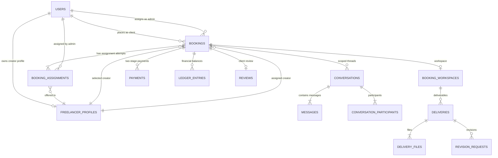

# Admin-Managed Migration — Step 2 Schema & State Specification

**Target System:** Antigravity Freelancer Marketplace  
**Architecture Phase:** Step 2 — Target Database Schema, State Machine & Migration Specification  
**Source of Truth:** Step 1 Architecture Audit (`admin_managed_migration_step1_architecture_audit.md`)  
**Status:** Design & Specification Only — Production Code & Database Untouched.

---

## 1. Executive Summary

This document establishes the comprehensive technical specification for transitioning the Antigravity Freelancer Marketplace from a **Direct Peer-to-Peer Model (`Client ↔ Freelancer`)** to an **Admin-Managed Managed Marketplace Model (`Client ↔ Admin ↔ Freelancer`)**.

### Key Architectural Pillars:
1. **Separation of Communication Lines:** Exactly two strictly isolated communication channels:
   - **Channel 1:** `Client ↔ Admin`
   - **Channel 2:** `Freelancer ↔ Admin`
   - **Zero Direct Contact:** Direct Client ↔ Freelancer communication is completely eliminated from active workflows while preserving historical chat records as read-only.
2. **Dedicated Assignment Architecture (`booking_assignments`):** An independent relational entity tracks the full matchmaking lifecycle, multi-round assignment attempts, Freelancer accept/decline responses, counter-offers, and Client replacement candidate approvals without overloading the `bookings` table.
3. **Preservation of Client Intent vs. Admin Match:** The database distinguishes between `selected_freelancer_profile_id` (the client's initial preference) and `freelancer_profile_id` (the actual assigned creator), enforcing client approval if Admin assigns a replacement creator.
4. **Normalized Multi-Tier State Machine:** Instead of creating a monolithic, brittle 25-state enum on `Booking`, lifecycle states are cleanly divided across `Booking.status`, `BookingAssignment.status`, `Delivery.status`, and `Payment.payment_completion_state`.
5. **Zero Data Loss & Backward Compatibility:** Existing historical bookings, projects, proposals, payments, and legacy chat threads remain fully readable and valid without data corruption.
6. **Untouched Landing & Public Pages:** Landing page, hero, public marketing sections, and public navbars remain 100% untouched.

---

## 2. Existing Schema Reuse Decisions

Based on the Step 1 Audit, the existing infrastructure is leveraged as follows:

| Existing Entity / Component | Reuse Decision | Architectural Rationale |
|---|---|---|
| `Booking` (`bookings`) | **REUSE WITH MODIFICATION** | Core scheduling, location, two-stage payment tracking (`deposit_amount`, `remaining_balance`, `total_paid`), and workspace links are retained. Add selection & admin metadata. |
| `Payment` (`payments`) | **KEEP AS-IS** | Razorpay provider integration, order generation, signature verification, webhooks, and payment attempts are 100% reusable. |
| `LedgerEntry` (`ledger_entries`) | **KEEP AS-IS** | Double-entry ledger with `PENDING` (locked) and `AVAILABLE` (withdrawable) states natively supports advance holds and payout maturation. |
| `Delivery` & `Revision` | **REUSE WITH MODIFICATION** | File bundling, version tracking (`version`), preview/final types, and revision comments are preserved. Add Admin review and delivery release gates. |
| `BookingWorkspace` | **KEEP AS-IS** | Secure container for files, links, and workspace event timelines is retained without structural change. |
| `Project` (`projects`) | **REUSE WITH MODIFICATION** | Title, description, budget, and location fields are retained. Status mapped to Admin matching pipeline. |
| `Proposal` (`proposals`) | **PRESERVE FOR LEGACY (READ-ONLY)** | Table preserved untouched for historical completed projects. New admin-managed workflow bypasses proposal bidding. |
| `Conversation` & `Message` | **REUSE WITH MODIFICATION** | Message attachments, edit windows, soft deletes, and read markers are retained. Add `conversation_type` and `admin_id` to partition channels. |
| `Review` (`reviews`) | **REUSE WITH MODIFICATION** | Star rating system, aggregate metrics, and moderation retained. Make `comment` column nullable to support rating-only reviews. |
| `Notification` (`notifications`)| **KEEP AS-IS** | Polymorphic event dispatcher with deduplication keys supports all new admin and assignment events. |
| `AdminAuditLog` | **KEEP AS-IS** | Immutable audit trail supports all new admin matchmaking and financial action codes. |

---

## 3. Target Booking Schema

### 3.1 Design Principles
- **No Overloading:** Assignment negotiation history, counter-offers, and replacement governance are stored in `booking_assignments`.
- **Dual Freelancer Tracking:**
  - `selected_freelancer_profile_id`: Captures the client's initial preference when booking directly from a service listing or creator profile (Nullable if client submitted an open project brief).
  - `freelancer_profile_id`: The currently active/confirmed freelancer assigned to execute the booking (Nullable upon initial creation until assignment is accepted).
- **Admin Association:** `assigned_by_admin_id` references the Admin user managing the booking.

### 3.2 Target `bookings` Table Definition

```sql
ALTER TABLE bookings
  ADD COLUMN selected_freelancer_profile_id INT NULL,
  ADD COLUMN assigned_by_admin_id INT NULL,
  ADD COLUMN is_admin_managed BOOLEAN NOT NULL DEFAULT 1,
  ADD COLUMN freelancer_payout_amount DECIMAL(10,2) NULL,
  ADD COLUMN admin_notes TEXT NULL,
  ADD CONSTRAINT fk_bookings_selected_freelancer FOREIGN KEY (selected_freelancer_profile_id) REFERENCES freelancer_profiles(id) ON DELETE SET NULL,
  ADD CONSTRAINT fk_bookings_assigned_by_admin FOREIGN KEY (assigned_by_admin_id) REFERENCES users(id) ON DELETE SET NULL;

-- Make freelancer_profile_id nullable on bookings table to support open project bookings before assignment is accepted:
ALTER TABLE bookings MODIFY freelancer_profile_id INT NULL;
```

#### Complete Field Specifications:
| Field Name | Type | Nullable | Default | Description |
|---|---|---|---|---|
| `id` | `Integer` | No | Auto | Primary Key |
| `booking_number` | `String(50)` | No | - | Public identifier (`BK-2026-XXXXXX`) |
| `client_id` | `Integer` | No | - | FK `users.id` (Client) |
| `selected_freelancer_profile_id` | `Integer` | Yes | `NULL` | FK `freelancer_profiles.id` (Client original choice) |
| `freelancer_profile_id` | `Integer` | Yes | `NULL` | FK `freelancer_profiles.id` (Currently assigned creator) |
| `assigned_by_admin_id` | `Integer` | Yes | `NULL` | FK `users.id` (Managing Admin) |
| `source_type` | `Enum` | No | `SERVICE` | `SERVICE`, `PROJECT` |
| `service_id` | `Integer` | Yes | `NULL` | FK `services.id` |
| `service_package_id` | `Integer` | Yes | `NULL` | FK `service_packages.id` |
| `project_id` | `Integer` | Yes | `NULL` | FK `projects.id` |
| `proposal_id` | `Integer` | Yes | `NULL` | FK `proposals.id` (Legacy only) |
| `status` | `Enum` | No | `SUBMITTED` | Target `BookingStatus` |
| `booking_type` | `String(50)` | No | `REMOTE` | `REMOTE`, `ON_SITE`, `HYBRID` |
| `scheduled_date` | `Date` | Yes | `NULL` | Shoot / Event / Start date |
| `start_time` | `Time` | Yes | `NULL` | Start time |
| `end_time` | `Time` | Yes | `NULL` | End time |
| `timezone` | `String(50)` | No | `Asia/Kolkata` | Timezone |
| `expected_duration_hours` | `Integer` | Yes | `NULL` | Duration estimate |
| `delivery_deadline` | `DateTime` | Yes | `NULL` | Delivery deadline |
| `location_city` | `String(100)` | Yes | `NULL` | Venue City |
| `location_state` | `String(100)` | Yes | `NULL` | Venue State |
| `location_country` | `String(100)` | Yes | `India` | Venue Country |
| `venue_name` | `String(255)` | Yes | `NULL` | Venue / Studio |
| `venue_address` | `Text` | Yes | `NULL` | Physical Address |
| `agreed_amount` | `Decimal(10,2)`| No | - | Total client price (Client pays platform) |
| `freelancer_payout_amount` | `Decimal(10,2)`| Yes | `NULL` | Total creator payout (Platform pays creator) |
| `currency` | `String(10)` | No | `INR` | Currency code |
| `deposit_amount` | `Decimal(10,2)`| No | `0.00` | Deposit required (30%) |
| `deposit_paid_amount` | `Decimal(10,2)`| No | `0.00` | Deposit captured |
| `remaining_balance` | `Decimal(10,2)`| No | `0.00` | Remaining balance required (70%) |
| `total_paid` | `Decimal(10,2)`| No | `0.00` | Cumulative amount paid by client |
| `payment_completion_state` | `String(50)` | No | `UNPAID` | `UNPAID`, `DEPOSIT_PAID`, `FULLY_PAID` |
| `final_approved_at` | `DateTime` | Yes | `NULL` | Client final approval timestamp |
| `dispute_window_ends_at` | `DateTime` | Yes | `NULL` | 48-hour dispute expiry |
| `notes` | `Text` | Yes | `NULL` | Client scope notes |
| `admin_notes` | `Text` | Yes | `NULL` | Internal admin matchmaking notes |
| `is_admin_managed` | `Boolean` | No | `True` | Migration flag (True for managed, False for legacy) |
| `cancellation_reason` | `Text` | Yes | `NULL` | Cancellation reason |
| `cancelled_by` | `String(50)` | Yes | `NULL` | `CLIENT`, `FREELANCER`, `ADMIN` |
| `confirmed_at` | `DateTime` | Yes | `NULL` | Confirmation timestamp |
| `started_at` | `DateTime` | Yes | `NULL` | Work start timestamp |
| `completed_at` | `DateTime` | Yes | `NULL` | Completion timestamp |
| `cancelled_at` | `DateTime` | Yes | `NULL` | Cancellation timestamp |
| `created_at` | `DateTime` | No | `now()` | Record creation |
| `updated_at` | `DateTime` | No | `now()` | Record update |

---

## 4. Booking Assignment Architecture

### 4.1 Recommendation: Dedicated `booking_assignments` Table
**We strongly recommend using a dedicated `booking_assignments` table.**

#### Why?
1. **Multi-Attempt History:** A booking may be offered to Freelancer A (declined), then Freelancer B (counter-offered / rejected by client), then Freelancer C (accepted). A single row per assignment preserves complete auditability.
2. **Counter-Offer Negotiation:** Allows structured tracking of counter-offered amounts, timeline proposals, and notes per candidate.
3. **Replacement Approval Governance:** When Freelancer A (the Client's choice) declines, and Admin offers Freelancer B, the client approval flag (`client_approval_required = True`, `client_approval_status = PENDING`) is tracked cleanly without polluting the main booking state.
4. **Zero State Collisions:** Multiple assignment rounds do not overwrite prior reasons or timestamps.

### 4.2 Target `booking_assignments` Table Definition

```sql
CREATE TABLE booking_assignments (
    id INT AUTO_INCREMENT PRIMARY KEY,
    booking_id INT NOT NULL,
    freelancer_profile_id INT NOT NULL,
    assigned_by_admin_id INT NOT NULL,
    assignment_round INT NOT NULL DEFAULT 1,
    
    -- Status & Financial Offer
    status VARCHAR(50) NOT NULL DEFAULT 'OFFERED', -- OFFERED, ACCEPTED, DECLINED, EXPIRED, CANCELLED
    offered_payout_amount DECIMAL(10,2) NOT NULL,
    
    -- Freelancer Response
    decline_reason TEXT NULL,
    counter_offer_amount DECIMAL(10,2) NULL,
    counter_offer_notes TEXT NULL,
    
    -- Client Replacement Approval
    is_replacement BOOLEAN NOT NULL DEFAULT 0,
    client_approval_required BOOLEAN NOT NULL DEFAULT 0,
    client_approval_status VARCHAR(50) NOT NULL DEFAULT 'NOT_REQUIRED', -- NOT_REQUIRED, PENDING, APPROVED, REJECTED
    client_approval_notes TEXT NULL,
    client_responded_at DATETIME NULL,
    
    -- Expiration & Timestamps
    expires_at DATETIME NULL,
    offered_at DATETIME NOT NULL DEFAULT CURRENT_TIMESTAMP,
    responded_at DATETIME NULL,
    created_at DATETIME NOT NULL DEFAULT CURRENT_TIMESTAMP,
    updated_at DATETIME NOT NULL DEFAULT CURRENT_TIMESTAMP ON UPDATE CURRENT_TIMESTAMP,
    
    -- Foreign Keys
    CONSTRAINT fk_ba_booking FOREIGN KEY (booking_id) REFERENCES bookings(id) ON DELETE CASCADE,
    CONSTRAINT fk_ba_freelancer FOREIGN KEY (freelancer_profile_id) REFERENCES freelancer_profiles(id) ON DELETE CASCADE,
    CONSTRAINT fk_ba_admin FOREIGN KEY (assigned_by_admin_id) REFERENCES users(id) ON DELETE CASCADE,
    
    INDEX ix_ba_booking_id (booking_id),
    INDEX ix_ba_freelancer_profile_id (freelancer_profile_id),
    INDEX ix_ba_status (status)
);
```

---

## 5. Project Schema

### 5.1 Project Source of Truth
- In the new target workflow, when a Client posts a project brief, Admin reviews it and creates/links an associated **`Booking`** upon assignment.
- **`projects` table does NOT need a duplicate `assigned_freelancer_id` column.**
- The single source of truth for the assigned creator is `bookings.freelancer_profile_id` linked via `bookings.project_id`.

### 5.2 Target `projects` Table Updates

```sql
ALTER TABLE projects
  ADD COLUMN is_admin_managed BOOLEAN NOT NULL DEFAULT 1,
  ADD COLUMN admin_reviewed_by_id INT NULL,
  ADD COLUMN admin_review_notes TEXT NULL,
  ADD CONSTRAINT fk_projects_admin_reviewer FOREIGN KEY (admin_reviewed_by_id) REFERENCES users(id) ON DELETE SET NULL;
```

---

## 6. Proposal Retirement Strategy

### 6.1 Safe Retirement without Data Loss
1. **Preserve Schema & Data:** The `proposals` table is **NEVER DROPPED**. All historical proposal records remain intact for auditing and legacy reporting.
2. **Bypass for New Managed Flow:** New projects are processed through the Admin matching pipeline (`projects.is_admin_managed = True`). The `proposals` table is simply not written to for new workflows.
3. **Backend Deprecation:** Legacy proposal endpoints (`POST /projects/{id}/proposals`, `POST /client/proposals/{id}/accept`) will return a graceful error (`410 Gone` or `400 Bad Request: Direct bidding has been transitioned to Admin-Managed matching`) once the cutover occurs.

---

## 7. Messaging Schema

### 7.1 Canonical Participant Model

Instead of an arbitrary pair of IDs in `conversations`, the target messaging architecture uses **two explicit, partitioned conversation types per booking/project**:

1. **`CLIENT_ADMIN`:** Links Client User and Admin User (Freelancer cannot see or access).
2. **`FREELANCER_ADMIN`:** Links Freelancer User and Admin User (Client cannot see or access).

### 7.2 Target `conversations` Table Updates

```sql
ALTER TABLE conversations
  ADD COLUMN conversation_type VARCHAR(50) NOT NULL DEFAULT 'DIRECT_LEGACY', -- CLIENT_ADMIN, FREELANCER_ADMIN, DIRECT_LEGACY, DISPUTE
  ADD COLUMN admin_id INT NULL,
  ADD COLUMN project_id INT NULL,
  ADD CONSTRAINT fk_conversations_admin FOREIGN KEY (admin_id) REFERENCES users(id) ON DELETE SET NULL,
  ADD CONSTRAINT fk_conversations_project FOREIGN KEY (project_id) REFERENCES projects(id) ON DELETE CASCADE;

-- Allow freelancer_id and client_id to be nullable so each conversation only contains the relevant party + admin:
ALTER TABLE conversations MODIFY client_id INT NULL;
ALTER TABLE conversations MODIFY freelancer_id INT NULL;

-- Unique constraint ensuring at most one conversation of each type per booking:
ALTER TABLE conversations ADD CONSTRAINT uq_booking_convo_type UNIQUE (booking_id, conversation_type);
```

### 7.3 Message Routing Logic

| Conversation Type | Permitted Senders / Readers | Forbidden Users |
|---|---|---|
| `CLIENT_ADMIN` | Client User (`client_id`), Admin User(s) | Freelancers (100% blocked with `403 Forbidden`) |
| `FREELANCER_ADMIN` | Freelancer User (`freelancer_id`), Admin User(s) | Clients (100% blocked with `403 Forbidden`) |
| `DIRECT_LEGACY` | Original Client & Freelancer (Read-Only) | New messages blocked |
| `DISPUTE` | Dispute participants & Assigned Admin | Uninvolved users |

---

## 8. Payment & Advance Architecture

### 8.1 Single Source of Truth for Advance / Locked Earnings: `LedgerEntry`

To prevent duplicate monetary states, **`LedgerEntry` is the single source of truth** for all creator balances:

```
Total Freelancer Earnings = SUM(amount WHERE status IN ('PENDING', 'AVAILABLE'))
Locked Advance / Pending Balance = SUM(amount WHERE status = 'PENDING')
Withdrawable Balance = SUM(amount WHERE status = 'AVAILABLE')
```

### 8.2 Maturation & Payout Release Lifecycle:
1. **Deposit Paid (30%):** Client pays deposit via Razorpay.
   - `Payment.status = 'CAPTURED'`
   - `Booking.payment_completion_state = 'DEPOSIT_PAID'`
   - `LedgerEntry` created for Freelancer: `entry_type = 'ADVANCE_CREDIT'` (or `PAYMENT_CREDIT`), `amount = agreed_advance`, `status = 'PENDING'`.
   - **Result:** Visible on Freelancer Dashboard under *"Locked Advance / In Escrow"*, but `PayoutService` strictly disallows withdrawal.
2. **Work In Progress & Final Delivery:** Balance paid (70%).
   - `Booking.payment_completion_state = 'FULLY_PAID'`
   - Remaining payout `LedgerEntry` created with `status = 'PENDING'`.
3. **Client Acceptance & Admin Payout Release:**
   - Client approves final deliverables.
   - Admin executes Payout Release action (`POST /api/v1/admin/bookings/{id}/release-payout`).
   - System updates `LedgerEntry.status = 'AVAILABLE'`.
   - **Result:** Creator can now click *"Withdraw Earnings"* via Razorpay payout transfer.

---

## 9. Delivery & Admin Review Architecture

### 9.1 Admin Quality Moderation Gate

Currently, deliveries uploaded by a Freelancer are immediately visible to the Client. The target architecture adds an **Admin Quality Gate**:

```
Freelancer uploads Deliverables in Workspace
                 ↓
Delivery created with status = 'SUBMITTED_TO_ADMIN'
(Visible to Freelancer & Admin only; Hidden from Client)
                 ↓
Admin Quality Inspection
        ┌────────┴────────┐
        ▼                 ▼
Admin Requests    Admin Approves Quality
Revision from     & Shares Draft / Final
Freelancer        with Client
(status =         (status = 'SHARED_WITH_CLIENT' /
'REVISION_REQ')   'DELIVERED_TO_CLIENT')
                          ↓
                  Client Reviews & Approves
                  (status = 'CLIENT_APPROVED')
```

### 9.2 Target `deliveries` Table Updates

```sql
ALTER TABLE deliveries
  ADD COLUMN admin_review_status VARCHAR(50) NOT NULL DEFAULT 'PENDING', -- PENDING, APPROVED, REVISION_REQUESTED
  ADD COLUMN admin_reviewed_by_id INT NULL,
  ADD COLUMN admin_reviewed_at DATETIME NULL,
  ADD COLUMN admin_feedback_to_freelancer TEXT NULL,
  ADD COLUMN shared_with_client_at DATETIME NULL,
  ADD CONSTRAINT fk_deliveries_admin_reviewer FOREIGN KEY (admin_reviewed_by_id) REFERENCES users(id) ON DELETE SET NULL;
```

---

## 10. Review Schema

### 10.1 Schema Update: Optional Review Comment

In current production code, `Review.comment` is `nullable=False`. In the target workflow, clients may choose to submit a **star rating only** without a written review.

```sql
ALTER TABLE reviews MODIFY comment TEXT NULL;
```

- `overall_rating` (`Integer`, 1 to 5): **Required**
- `comment` (`Text`): **Optional / Nullable**

---

## 11. Audit Logging Specification

The existing `admin_audit_logs` table natively supports all required admin matchmaking, assignment, and financial moderation events:

| Action Code | Entity Type | Triggering Admin Action | Metadata JSON Structure |
|---|---|---|---|
| `BOOKING_REVIEWED` | `booking` | Admin approves client booking scope | `{"booking_id": 1, "approved_price": 5000}` |
| `FREELANCER_ASSIGNED`| `booking` | Admin dispatches job offer to creator | `{"assignment_id": 10, "freelancer_id": 4, "offered_amount": 3500}` |
| `FREELANCER_DECLINED`| `booking` | Freelancer declines assignment | `{"assignment_id": 10, "reason": "Conflict", "counter_offer": 4000}` |
| `REPLACEMENT_SUGGESTED`| `booking` | Admin suggests replacement creator | `{"original_freelancer_id": 4, "replacement_freelancer_id": 7}` |
| `REPLACEMENT_APPROVED` | `booking` | Client approves replacement creator | `{"booking_id": 1, "approved_freelancer_id": 7}` |
| `DEPOSIT_CONFIRMED` | `payment` | 30% deposit captured | `{"payment_id": 12, "deposit_amount": 1500}` |
| `ADVANCE_RECORDED` | `ledger` | Advance hold credited to creator | `{"ledger_id": 44, "advance_amount": 1000}` |
| `DELIVERY_REVIEWED` | `delivery` | Admin approves creator submission | `{"delivery_id": 5, "status": "APPROVED"}` |
| `DRAFT_SHARED` | `delivery` | Admin shares preview draft with Client | `{"delivery_id": 5, "client_id": 2}` |
| `BALANCE_CONFIRMED` | `payment` | 70% remaining balance captured | `{"payment_id": 15, "balance_amount": 3500}` |
| `FINAL_DELIVERED` | `delivery` | Final deliverable released to Client | `{"delivery_id": 8, "version": 2}` |
| `BOOKING_COMPLETED` | `booking` | Admin or 48h timer completes booking | `{"booking_id": 1, "completed_at": "..."}` |
| `PAYOUT_RELEASED` | `payout` | Admin releases creator earnings | `{"freelancer_id": 7, "released_amount": 3500}` |

---

## 12. Booking State Machine

```
                              ┌────────────────────┐
                              │     SUBMITTED      │ (Client submits request)
                              └─────────┬──────────┘
                                        │
                                        ▼ (Admin reviews brief)
                              ┌────────────────────┐
                              │MATCHING_IN_PROGRESS│ (Admin searches/offers to creator)
                              └─────────┬──────────┘
                                        │
             ┌──────────────────────────┴──────────────────────────┐
             ▼ (Freelancer declines)                               ▼ (Freelancer accepts & Client approves)
┌──────────────────────────┐                             ┌────────────────────┐
│   ASSIGNMENT_DECLINED    │                             │     CONFIRMED      │
│ (Admin reassigns/counter)│                             │(Awaiting 30% dep.) │
└────────────┬─────────────┘                             └─────────┬──────────┘
             │                                                     │
             └────────────────► Admin Reassigns                    ▼ (Deposit paid via Razorpay)
                                                                 ┌────────────────────┐
                                                                 │    IN_PROGRESS     │ (Work started by creator)
                                                                 └─────────┬──────────┘
                                                                           │
                                                                           ▼ (Creator submits to Admin QA)
                                                                 ┌────────────────────┐
                                                                 │  DELIVERY_PENDING  │ (Admin & Client review)
                                                                 └─────────┬──────────┘
                                                                           │
                                                                           ▼ (Client accepts & Admin signs off)
                                                                 ┌────────────────────┐
                                                                 │     COMPLETED      │ (Payout released)
                                                                 └────────────────────┘
```

### 12.1 Normalized Booking States (`Booking.status` Enum):
1. `SUBMITTED`: Client submitted request; pending Admin review.
2. `MATCHING_IN_PROGRESS`: Admin actively curating and offering job to creators.
3. `CONFIRMED`: Freelancer assignment accepted; contract terms locked; awaiting deposit.
4. `IN_PROGRESS`: Deposit paid; work actively underway.
5. `DELIVERY_PENDING`: Deliverables under Admin/Client review; awaiting final balance.
6. `COMPLETED`: Deliverables accepted; balance paid; payout released.
7. `CANCELLED`: Booking cancelled prior to completion.
8. `REJECTED`: Request rejected during initial admin review.
9. `RESCHEDULE_REQUESTED`: Shoot/event reschedule request pending response.

---

## 13. Project State Machine (`Project.status`)

1. `SUBMITTED`: Client published creative brief; awaiting Admin curation.
2. `UNDER_ADMIN_REVIEW`: Admin evaluating scope, budget, and suitability.
3. `MATCHING`: Admin actively searching for and contacting suitable creators.
4. `BOOKING_CREATED`: Creator selected; converted into managed `Booking`.
5. `COMPLETED`: All project deliverables finished and accepted.
6. `CANCELLED`: Project closed/cancelled by Client or Admin.

---

## 14. Assignment State Machine (`BookingAssignment.status`)

1. `OFFERED`: Admin sent job assignment offer to Freelancer.
2. `ACCEPTED`: Freelancer accepted the assignment.
3. `DECLINED`: Freelancer rejected the assignment (with decline reason and optional counter-offer).
4. `EXPIRED`: Freelancer did not respond within the offer window.
5. `CANCELLED`: Admin retracted the offer before freelancer response.

---

## 15. Role Permission Matrix

| Action / Capability | Client | Freelancer | Admin | System / Gate |
|---|---|---|---|---|
| **Submit Booking / Project Brief** | **YES** | NO | **YES** | Requires authenticated Client |
| **Review & Curate Project Brief** | NO | NO | **YES** | Admin privilege only |
| **Search & Assign Freelancer** | NO | NO | **YES** | Admin privilege only |
| **Accept / Decline Job Assignment**| NO | **YES** | NO | Assigned Freelancer only |
| **Approve Replacement Freelancer** | **YES** | NO | NO | Required if assigned differs from selected |
| **Message Client** | NO | NO | **YES** | Via `CLIENT_ADMIN` conversation |
| **Message Freelancer** | NO | NO | **YES** | Via `FREELANCER_ADMIN` conversation |
| **Direct Peer-to-Peer Chat** | **NO (BLOCKED)**| **NO (BLOCKED)**| N/A | Direct peer chat disabled |
| **Pay Upfront Deposit (30%)** | **YES** | NO | NO | Gateway checkout |
| **Start Work on Booking** | NO | **YES** | NO | Gate: Deposit must be captured |
| **Submit Deliverables to Admin** | NO | **YES** | NO | Uploads to Workspace |
| **Review & Approve Deliverable** | NO | NO | **YES** | Admin Quality Inspection |
| **Share Draft with Client** | NO | NO | **YES** | Admin release action |
| **Request Deliverable Revision** | **YES** | NO | **YES** | Client via Admin, or Admin direct |
| **Pay Final Balance (70%)** | **YES** | NO | NO | Gate: Before final download |
| **Deliver Final Package to Client**| NO | NO | **YES** | Gate: Balance must be paid |
| **Accept Final Delivery** | **YES** | NO | **YES** | Client signoff or 48h dispute timer |
| **Complete Booking** | NO | NO | **YES** | Admin closure |
| **Release Creator Payout** | NO | NO | **YES** | Admin release trigger |
| **Submit Creator Review** | **YES** | NO | NO | Post-completion only |

---

## 16. Source of Truth Matrix

To prevent data duplication and conflicting states, every core business property has exactly **one canonical source of truth**:

| Business Concept | Canonical Source of Truth | Secondary / Cache / Derived View |
|---|---|---|
| **Original Client Preference** | `bookings.selected_freelancer_profile_id` | Initial booking form metadata |
| **Currently Assigned Creator** | Accepted row in `booking_assignments` | Cached on `bookings.freelancer_profile_id` |
| **Assignment History & Reasons**| `booking_assignments` table | Admin assignment modal |
| **Client Replacement Approval**| `booking_assignments.client_approval_status` | Client approval banner |
| **Client Payment Progress** | `Payment` & `bookings.payment_completion_state` | `bookings.total_paid` |
| **Creator Payout & Advance** | `LedgerEntry` (`status='PENDING'|'AVAILABLE'`) | Freelancer earnings dashboard |
| **Delivery Quality Status** | `deliveries.admin_review_status` | Delivery inspection badge |
| **Conversation Routing** | `conversations.conversation_type` & `admin_id` | Chat window participant list |
| **Dispute Status** | `disputes.status` | Booking dispute banner |

---

## 17. Constraints & Business Invariants

1. **At Most One Active Assignment:** A database trigger or unique constraint enforces that at any given time, a `booking_id` can have at most **ONE** assignment with `status = 'OFFERED'` or `status = 'ACCEPTED'`.
2. **Deposit Work Gate:** The backend endpoint `POST /freelancer/bookings/{id}/start` strictly verifies `booking.payment_completion_state IN ('DEPOSIT_PAID', 'FULLY_PAID')`. Work cannot start on unpaid bookings.
3. **Balance Final Delivery Gate:** The endpoint `POST /admin/bookings/{id}/deliver-final` strictly verifies `booking.payment_completion_state == 'FULLY_PAID'`, preventing final asset release without full client payment.
4. **Mandatory Decline Reason:** When a Freelancer declines an assignment via `POST /freelancer/assignments/{id}/decline`, `decline_reason` must be a non-empty string of minimum 5 characters.
5. **Replacement Creator Approval:** If `booking.selected_freelancer_profile_id != assignment.freelancer_profile_id`, the assignment cannot transition to `CONFIRMED` until `assignment.client_approval_status == 'APPROVED'`.

---

## 18. Existing Data Migration Strategy

### 18.1 Non-Breaking Backfill Rules
1. **Existing Bookings:**
   - Add `is_admin_managed = 0` (False) for all legacy rows.
   - Set `selected_freelancer_profile_id = freelancer_profile_id` on existing rows.
2. **Existing Projects:**
   - Add `is_admin_managed = 0` for all legacy rows.
3. **Existing Conversations:**
   - Add `conversation_type = 'DIRECT_LEGACY'` for all existing rows where `workspace_id IS NULL`.
   - Existing messages remain intact and accessible to historical participants.
4. **Existing Proposals:**
   - All rows remain untouched and fully readable.
5. **Nullability Safety:**
   - All newly added foreign keys and columns are either `NULL` or have safe defaults (`server_default`), ensuring zero downtime and zero migration locks on live tables.

---

## 19. Alembic Migration Specification

*Note: This migration specification is prepared for Step 3 implementation. Do NOT execute in Step 2.*

```python
"""add_admin_managed_marketplace_schema

Revision ID: 8a1b2c3d4e5f
Revises: 5cd117098c69
Create Date: 2026-08-31 12:00:00.000000

"""
from alembic import op
import sqlalchemy as sa

revision = '8a1b2c3d4e5f'
down_revision = '5cd117098c69'
branch_labels = None
depends_on = None

def upgrade() -> None:
    # 1. Update bookings table
    op.add_column('bookings', sa.Column('selected_freelancer_profile_id', sa.Integer(), nullable=True))
    op.add_column('bookings', sa.Column('assigned_by_admin_id', sa.Integer(), nullable=True))
    op.add_column('bookings', sa.Column('is_admin_managed', sa.Boolean(), server_default='1', nullable=False))
    op.add_column('bookings', sa.Column('freelancer_payout_amount', sa.Numeric(precision=10, scale=2), nullable=True))
    op.add_column('bookings', sa.Column('admin_notes', sa.Text(), nullable=True))
    
    op.alter_column('bookings', 'freelancer_profile_id', existing_type=sa.Integer(), nullable=True)
    
    op.create_foreign_key('fk_bookings_selected_freelancer', 'bookings', 'freelancer_profiles', ['selected_freelancer_profile_id'], ['id'], ondelete='SET NULL')
    op.create_foreign_key('fk_bookings_assigned_by_admin', 'bookings', 'users', ['assigned_by_admin_id'], ['id'], ondelete='SET NULL')
    op.create_index(op.f('ix_bookings_selected_freelancer_profile_id'), 'bookings', ['selected_freelancer_profile_id'], unique=False)
    op.create_index(op.f('ix_bookings_assigned_by_admin_id'), 'bookings', ['assigned_by_admin_id'], unique=False)

    # 2. Create booking_assignments table
    op.create_table(
        'booking_assignments',
        sa.Column('id', sa.Integer(), nullable=False),
        sa.Column('booking_id', sa.Integer(), nullable=False),
        sa.Column('freelancer_profile_id', sa.Integer(), nullable=False),
        sa.Column('assigned_by_admin_id', sa.Integer(), nullable=False),
        sa.Column('assignment_round', sa.Integer(), server_default='1', nullable=False),
        sa.Column('status', sa.String(length=50), server_default='OFFERED', nullable=False),
        sa.Column('offered_payout_amount', sa.Numeric(precision=10, scale=2), nullable=False),
        sa.Column('decline_reason', sa.Text(), nullable=True),
        sa.Column('counter_offer_amount', sa.Numeric(precision=10, scale=2), nullable=True),
        sa.Column('counter_offer_notes', sa.Text(), nullable=True),
        sa.Column('is_replacement', sa.Boolean(), server_default='0', nullable=False),
        sa.Column('client_approval_required', sa.Boolean(), server_default='0', nullable=False),
        sa.Column('client_approval_status', sa.String(length=50), server_default='NOT_REQUIRED', nullable=False),
        sa.Column('client_approval_notes', sa.Text(), nullable=True),
        sa.Column('client_responded_at', sa.DateTime(timezone=True), nullable=True),
        sa.Column('expires_at', sa.DateTime(timezone=True), nullable=True),
        sa.Column('offered_at', sa.DateTime(timezone=True), server_default=sa.text('now()'), nullable=False),
        sa.Column('responded_at', sa.DateTime(timezone=True), nullable=True),
        sa.Column('created_at', sa.DateTime(timezone=True), server_default=sa.text('now()'), nullable=False),
        sa.Column('updated_at', sa.DateTime(timezone=True), server_default=sa.text('now()'), nullable=False),
        sa.ForeignKeyConstraint(['assigned_by_admin_id'], ['users.id'], ondelete='CASCADE'),
        sa.ForeignKeyConstraint(['booking_id'], ['bookings.id'], ondelete='CASCADE'),
        sa.ForeignKeyConstraint(['freelancer_profile_id'], ['freelancer_profiles.id'], ondelete='CASCADE'),
        sa.PrimaryKeyConstraint('id')
    )
    op.create_index(op.f('ix_booking_assignments_booking_id'), 'booking_assignments', ['booking_id'], unique=False)
    op.create_index(op.f('ix_booking_assignments_freelancer_profile_id'), 'booking_assignments', ['freelancer_profile_id'], unique=False)
    op.create_index(op.f('ix_booking_assignments_status'), 'booking_assignments', ['status'], unique=False)

    # 3. Update projects table
    op.add_column('projects', sa.Column('is_admin_managed', sa.Boolean(), server_default='1', nullable=False))
    op.add_column('projects', sa.Column('admin_reviewed_by_id', sa.Integer(), nullable=True))
    op.add_column('projects', sa.Column('admin_review_notes', sa.Text(), nullable=True))
    op.create_foreign_key('fk_projects_admin_reviewer', 'projects', 'users', ['admin_reviewed_by_id'], ['id'], ondelete='SET NULL')

    # 4. Update conversations table
    op.add_column('conversations', sa.Column('conversation_type', sa.String(length=50), server_default='DIRECT_LEGACY', nullable=False))
    op.add_column('conversations', sa.Column('admin_id', sa.Integer(), nullable=True))
    op.add_column('conversations', sa.Column('project_id', sa.Integer(), nullable=True))
    op.alter_column('conversations', 'client_id', existing_type=sa.Integer(), nullable=True)
    op.alter_column('conversations', 'freelancer_id', existing_type=sa.Integer(), nullable=True)
    op.create_foreign_key('fk_conversations_admin', 'conversations', 'users', ['admin_id'], ['id'], ondelete='SET NULL')
    op.create_foreign_key('fk_conversations_project', 'conversations', 'projects', ['project_id'], ['id'], ondelete='CASCADE')
    op.create_index(op.f('ix_conversations_conversation_type'), 'conversations', ['conversation_type'], unique=False)

    # 5. Update deliveries table
    op.add_column('deliveries', sa.Column('admin_review_status', sa.String(length=50), server_default='PENDING', nullable=False))
    op.add_column('deliveries', sa.Column('admin_reviewed_by_id', sa.Integer(), nullable=True))
    op.add_column('deliveries', sa.Column('admin_reviewed_at', sa.DateTime(timezone=True), nullable=True))
    op.add_column('deliveries', sa.Column('admin_feedback_to_freelancer', sa.Text(), nullable=True))
    op.add_column('deliveries', sa.Column('shared_with_client_at', sa.DateTime(timezone=True), nullable=True))
    op.create_foreign_key('fk_deliveries_admin_reviewer', 'deliveries', 'users', ['admin_reviewed_by_id'], ['id'], ondelete='SET NULL')

    # 6. Update reviews table (make comment nullable)
    op.alter_column('reviews', 'comment', existing_type=sa.Text(), nullable=True)

def downgrade() -> None:
    op.alter_column('reviews', 'comment', existing_type=sa.Text(), nullable=False)
    
    op.drop_constraint('fk_deliveries_admin_reviewer', 'deliveries', type_='foreignkey')
    op.drop_column('deliveries', 'shared_with_client_at')
    op.drop_column('deliveries', 'admin_feedback_to_freelancer')
    op.drop_column('deliveries', 'admin_reviewed_at')
    op.drop_column('deliveries', 'admin_reviewed_by_id')
    op.drop_column('deliveries', 'admin_review_status')

    op.drop_constraint('fk_conversations_project', 'conversations', type_='foreignkey')
    op.drop_constraint('fk_conversations_admin', 'conversations', type_='foreignkey')
    op.drop_index(op.f('ix_conversations_conversation_type'), table_name='conversations')
    op.drop_column('conversations', 'project_id')
    op.drop_column('conversations', 'admin_id')
    op.drop_column('conversations', 'conversation_type')
    op.alter_column('conversations', 'freelancer_id', existing_type=sa.Integer(), nullable=False)
    op.alter_column('conversations', 'client_id', existing_type=sa.Integer(), nullable=False)

    op.drop_constraint('fk_projects_admin_reviewer', 'projects', type_='foreignkey')
    op.drop_column('projects', 'admin_review_notes')
    op.drop_column('projects', 'admin_reviewed_by_id')
    op.drop_column('projects', 'is_admin_managed')

    op.drop_table('booking_assignments')

    op.drop_constraint('fk_bookings_assigned_by_admin', 'bookings', type_='foreignkey')
    op.drop_constraint('fk_bookings_selected_freelancer', 'bookings', type_='foreignkey')
    op.drop_column('bookings', 'admin_notes')
    op.drop_column('bookings', 'freelancer_payout_amount')
    op.drop_column('bookings', 'is_admin_managed')
    op.drop_column('bookings', 'assigned_by_admin_id')
    op.drop_column('bookings', 'selected_freelancer_profile_id')
    op.alter_column('bookings', 'freelancer_profile_id', existing_type=sa.Integer(), nullable=False)
```

---

## 20. Target Relationship Diagram



---

## 21. API Impact Preview

| Method & Route | Target Business Purpose | Role Allowed | Status / Action |
|---|---|---|---|
| `POST /api/v1/client/bookings` | Submit managed booking request | `CLIENT` | **MODIFY** (Routes to Admin matching) |
| `POST /api/v1/projects` | Submit managed creative brief | `CLIENT` | **MODIFY** (Routes to Admin review) |
| `GET /api/v1/admin/bookings/unassigned`| List bookings awaiting matching | `ADMIN` | **NEW API** |
| `POST /api/v1/admin/bookings/{id}/assign`| Dispatch assignment offer to creator | `ADMIN` | **NEW API** |
| `GET /api/v1/freelancer/assignments` | List received assignment offers | `FREELANCER` | **NEW API** |
| `POST /api/v1/freelancer/assignments/{id}/accept`| Accept job offer | `FREELANCER` | **NEW API** |
| `POST /api/v1/freelancer/assignments/{id}/decline`| Decline offer (reason + counter) | `FREELANCER` | **NEW API** |
| `POST /api/v1/client/assignments/{id}/approve` | Client approves replacement creator | `CLIENT` | **NEW API** |
| `GET /api/v1/admin/messages` | Central Admin dual inbox | `ADMIN` | **NEW API** |
| `POST /api/v1/deliveries/{id}/admin-review`| Admin inspects and approves draft | `ADMIN` | **NEW API** |
| `POST /api/v1/admin/bookings/{id}/deliver-final`| Admin releases final package | `ADMIN` | **NEW API** |
| `POST /api/v1/admin/bookings/{id}/release-payout`| Admin unlocks creator payout | `ADMIN` | **NEW API** |
| `POST /api/v1/projects/{id}/proposals` | Legacy proposal submission | - | **RETIRE** |
| `POST /api/v1/client/proposals/{id}/accept` | Legacy direct proposal awarding | - | **RETIRE** |

---

## 22. Step 3 Implementation Plan

Following approval of this specification, **Step 3 Implementation** should be executed in 5 safe, modular sub-phases:

```
┌────────────────────────────────────────────────────────┐
│ Phase 3A: Non-Breaking Database Migration & Models     │
│ - Apply Alembic migration (tables, columns, indexes)   │
│ - Update SQLAlchemy models in backend/app/models/      │
└──────────────────────────┬─────────────────────────────┘
                           │
┌──────────────────────────▼─────────────────────────────┐
│ Phase 3B: Schemas, Repositories & Core Services        │
│ - Create Pydantic schemas for assignments & moderation │
│ - Implement BookingAssignmentRepository & Service logic│
└──────────────────────────┬─────────────────────────────┘
                           │
┌──────────────────────────▼─────────────────────────────┐
│ Phase 3C: Admin & Freelancer API Routers               │
│ - Implement Admin Matchmaking & Inbox API endpoints    │
│ - Implement Freelancer Job Offer Accept/Decline APIs   │
└──────────────────────────┬─────────────────────────────┘
                           │
┌──────────────────────────▼─────────────────────────────┐
│ Phase 3D: Frontend UI Integration                      │
│ - Build Admin Matchmaking Modal & Central Inbox        │
│ - Build Freelancer Job Offers Screen                   │
│ - Update Client Project View to Match Status           │
└──────────────────────────┬─────────────────────────────┘
                           │
┌──────────────────────────▼─────────────────────────────┐
│ Phase 3E: End-to-End Verification & Regression Audit   │
│ - Automated API connectivity & integration tests       │
│ - Verification that Landing Page remains untouched     │
└────────────────────────────────────────────────────────┘
```

---

## 23. Answers to Core Step 2 Design Questions

1. **Should we use `booking_assignments` table? YES/NO and why.**  
   **YES.** A dedicated `booking_assignments` table prevents schema overloading on `bookings`, captures complete multi-round assignment history, stores structured rejection reasons and counter-offers, and cleanly isolates Client replacement approval state.

2. **What should be the source of truth for selected Freelancer?**  
   `bookings.selected_freelancer_profile_id` (representing the Client's initial preference).

3. **What should be the source of truth for assigned Freelancer?**  
   The active accepted record in `booking_assignments` (cached on `bookings.freelancer_profile_id` once confirmed).

4. **Where should counter offers be stored?**  
   In `booking_assignments` (`counter_offer_amount`, `counter_offer_notes`, `decline_reason`), allowing multiple negotiation rounds without data loss.

5. **Where should replacement approval be stored?**  
   In `booking_assignments` (`is_replacement`, `client_approval_required`, `client_approval_status`, `client_approval_notes`, `client_responded_at`).

6. **Do we need `assignment_status` on `Booking`?**  
   **NO.** The assignment status lives in `booking_assignments.status`. `Booking.status` simply reflects the high-level lifecycle state (`MATCHING_IN_PROGRESS` or `CONFIRMED`).

7. **Do we need `freelancer_response` on `Booking`?**  
   **NO.** Redundant. The Freelancer's response is the status of the assignment (`ACCEPTED` or `DECLINED`) in `booking_assignments`.

8. **How should Client ↔ Admin conversations be represented?**  
   In `conversations` with `conversation_type = 'CLIENT_ADMIN'`, linking `client_id` and `admin_id` (`freelancer_id = NULL`).

9. **How should Freelancer ↔ Admin conversations be represented?**  
   In `conversations` with `conversation_type = 'FREELANCER_ADMIN'`, linking `freelancer_id` and `admin_id` (`client_id = NULL`).

10. **How should legacy direct chats be preserved?**  
    Preserved untouched in `conversations` with `conversation_type = 'DIRECT_LEGACY'`, accessible in read-only mode for historical context.

11. **Which existing `BookingStatus` values can be reused?**  
    `REQUESTED` (renamed/aliased as `SUBMITTED`), `CONFIRMED`, `IN_PROGRESS`, `DELIVERY_PENDING`, `COMPLETED`, `CANCELLED`, `REJECTED`, `RESCHEDULE_REQUESTED`.

12. **Which new Booking statuses are actually necessary?**  
    Only **`MATCHING_IN_PROGRESS`** (all other fine-grained sub-states are represented by `BookingAssignment.status`, `Delivery.status`, and `Payment.payment_completion_state`).

13. **Which Project statuses are necessary?**  
    `SUBMITTED`, `UNDER_ADMIN_REVIEW`, `MATCHING`, `BOOKING_CREATED`, `COMPLETED`, `CANCELLED`.

14. **Where should locked Freelancer advance be stored?**  
    In `ledger_entries` with `entry_type = 'ADVANCE_CREDIT'` and `status = 'PENDING'` (single source of truth).

15. **How does it become withdrawable?**  
    Upon final deliverable acceptance and Admin payout release, the ledger entry's status is updated from `'PENDING'` to `'AVAILABLE'`.

16. **Which Delivery schema changes are necessary?**  
    Add `admin_review_status`, `admin_reviewed_by_id`, `admin_reviewed_at`, and `shared_with_client_at` to the `deliveries` table.

17. **Is `Review.comment` currently nullable?**  
    **NO** (currently `nullable=False`). The migration updates it to `nullable=True` to support star-rating-only reviews.

18. **What is the safest Alembic migration sequence?**  
    A single non-destructive upgrade adding columns with `nullable=True` or safe defaults, creating `booking_assignments`, and relaxing nullability constraints on `reviews.comment` and `conversations`.

19. **Can existing records survive migration unchanged?**  
    **YES.** All existing bookings, projects, proposals, messages, payments, and reviews will remain valid and fully functional.

20. **What exactly should Step 3 implement first?**  
    **Phase 3A:** Execute the Alembic migration script and update SQLAlchemy model definitions in `backend/app/models/`.
