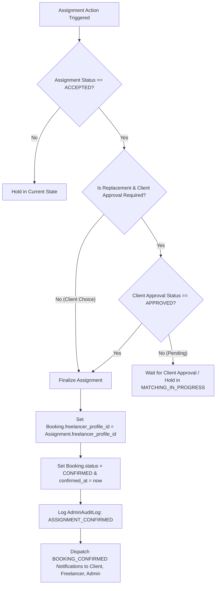

# Admin-Managed Marketplace Migration — Step 3B: Admin Assignment Backend Engine Implementation Report

## 1. Executive Summary

This report documents the backend implementation of the **Admin Assignment Backend Engine (Step 3B)** for the Creative Freelancer Marketplace. Building directly on the foundational database schema established in Step 3A, this phase implements the end-to-end business logic, transaction locking, multi-round renegotiation, client replacement approval, audit ledger logging, and transactional event notifications.

All 18 automated integration test scenarios in the Step 3B test suite and 7 tests in the Step 3A data layer suite passed with **100% success rate (25/25 passed)** against MySQL 8.0 running in Docker.

Zero changes were made to frontend UI, marketing pages, or the public landing page.

---

## 2. Architecture & Service Layer Design

### 2.1 Core Service (`backend/app/services/assignment_service.py`)

The core business logic is encapsulated in `AssignmentService`, providing transactional, thread-safe methods for all three marketplace actors:

| Method | Role | Purpose |
|---|---|---|
| `list_admin_bookings` | Admin | Filtered list of managed bookings with client, creator, latest assignment, and financial summaries. |
| `get_admin_booking_detail` | Admin | Comprehensive operational view including complete chronological assignment history. |
| `review_booking` | Admin | Transitions booking from `REQUESTED` to `MATCHING_IN_PROGRESS` with audit logging. |
| `assign_freelancer` | Admin | Proposes creator offer (Round 1/2/3...), evaluates replacement rules, creates `BookingAssignment` with status `OFFERED`. |
| `list_freelancer_assignments` | Freelancer | Retrieves assignment offers scoped strictly to authenticated freelancer with sanitized booking details. |
| `freelancer_accept_assignment` | Freelancer | Idempotently transitions offer to `ACCEPTED` and triggers finalization attempt. |
| `freelancer_reject_assignment` | Freelancer | Records mandatory decline reason, optional counter-offer amount and notes, keeping booking in matching state. |
| `client_respond_to_replacement` | Client | Enables client to approve or decline replacement proposals suggested by admin. |
| `try_finalize_assignment` | System / Helper | Atomic two-condition finalization evaluator. |

---

### 2.2 Two-Condition Finalization Algorithm (`try_finalize_assignment`)



#### Invariant Guarantees:
1. `Booking.freelancer_profile_id` is **NEVER** set at the time an offer is created. It remains `NULL` (or unconfirmed) until `try_finalize_assignment` succeeds.
2. If `is_replacement == True`, the assignment is finalized **ONLY** when BOTH conditions are satisfied:
   - Creator has accepted (`status == 'ACCEPTED'`)
   - Client has approved (`client_approval_status == 'APPROVED'`)
3. If Client rejects a replacement (`client_approval_status == 'REJECTED'`), the assignment is cancelled (`status = 'CANCELLED'`), `Booking.freelancer_profile_id` remains `NULL`, and the booking remains in `MATCHING_IN_PROGRESS`.

---

## 3. Endpoints Implemented

### 3.1 Admin Endpoints (`backend/app/api/v1/endpoints/admin_management.py`)
- `GET /api/v1/admin/bookings`
  - Query parameters: `status`, `assignment_status`, `source_type`, `date_from`, `date_to`, `client_id`, `freelancer_profile_id`, `search`, `page`, `page_size`.
  - Response: `List[AdminBookingListItem]`
- `GET /api/v1/admin/bookings/{id}`
  - Response: `AdminBookingDetail` (includes complete `assignments` array and `payment_summary`)
- `POST /api/v1/admin/bookings/{id}/review`
  - Payload: `{"admin_notes": "Optional notes"}`
  - Response: `AdminBookingDetail` (status updated to `MATCHING_IN_PROGRESS`)
- `POST /api/v1/admin/bookings/{id}/assign`
  - Payload: `{"freelancer_profile_id": int, "offered_payout_amount": Optional[Decimal], "admin_notes": Optional[str], "expires_at": Optional[datetime]}`
  - Response: `BookingAssignmentOut`

### 3.2 Freelancer Endpoints (`backend/app/api/v1/endpoints/freelancer_bookings.py`)
- `GET /api/v1/freelancer/bookings/assignments` (alias: `GET /api/v1/freelancer/assignments`)
  - Scoped to `current_user.id -> FreelancerProfile.id`.
  - Response: `List[FreelancerAssignmentListItem]`
- `POST /api/v1/freelancer/assignments/{id}/accept`
  - Response: `BookingAssignmentOut`
- `POST /api/v1/freelancer/assignments/{id}/reject`
  - Payload: `{"reason": "Mandatory text", "counter_offer_amount": Optional[Decimal], "counter_offer_notes": Optional[str]}`
  - Response: `BookingAssignmentOut`

### 3.3 Client Endpoints (`backend/app/api/v1/endpoints/client_bookings.py`)
- `POST /api/v1/client/bookings/{booking_id}/replacement/{assignment_id}/respond` (alias: `POST /api/v1/client/assignments/{assignment_id}/respond`)
  - Payload: `{"approved": bool, "notes": Optional[str]}`
  - Response: `BookingAssignmentOut`

---

## 4. Multi-Round Negotiation & History Preservation

When Freelancer A rejects or submits a counter-offer on Round 1:
1. Round 1 assignment row retains `status = 'DECLINED'`, `decline_reason`, `counter_offer_amount`, and `counter_offer_notes`.
2. Admin reviews the counter-offer in `GET /api/v1/admin/bookings/{id}`.
3. Admin reassigns via `POST /api/v1/admin/bookings/{id}/assign` with updated payout.
4. Engine computes `assignment_round = 2`, creating a new `BookingAssignment` row with `status = 'OFFERED'`.
5. Full chronological audit trail is preserved without overwriting history.

---

## 5. Audit Logging & Notification Dispatch Matrix

| Event Code / Action | Entity Type | Recipient / Actor | In-App Notice Title | Audit Log Action |
|---|---|---|---|---|
| `BOOKING_REVIEWED` | `BOOKING` | Admin | — | `BOOKING_REVIEWED` |
| `BOOKING_ASSIGNED` | `BOOKING_ASSIGNMENT` | Freelancer | New Booking Assignment Offer | `FREELANCER_ASSIGNED` |
| `REPLACEMENT_REQUESTED` | `BOOKING_ASSIGNMENT` | Client | Creator Replacement Proposed | `REPLACEMENT_SUGGESTED` |
| `ASSIGNMENT_ACCEPTED` | `BOOKING_ASSIGNMENT` | Admin | Creator Accepted Assignment | `FREELANCER_ACCEPTED_AWAITING_CLIENT` |
| `ASSIGNMENT_DECLINED` | `BOOKING_ASSIGNMENT` | Admin | Assignment Declined | `FREELANCER_REJECTED` |
| `ASSIGNMENT_COUNTERED` | `BOOKING_ASSIGNMENT` | Admin | Assignment Counter-Offer | `COUNTER_OFFER_RECEIVED` |
| `REPLACEMENT_APPROVED` | `BOOKING_ASSIGNMENT` | Admin | Client Approved Replacement | `REPLACEMENT_APPROVED` |
| `REPLACEMENT_REJECTED` | `BOOKING_ASSIGNMENT` | Admin | Client Rejected Replacement | `REPLACEMENT_REJECTED` |
| `BOOKING_CONFIRMED` | `BOOKING` | Client, Freelancer, Admin | Creator Confirmed for Your Booking! | `ASSIGNMENT_CONFIRMED` |

---

## 6. Verification & Test Matrix

All 18 automated integration test scenarios in `backend/tests/test_step3b_assignments.py` were executed against MySQL 8.0.

```
tests/test_step3b_assignments.py::test_01_admin_review_booking PASSED                    [  5%]
tests/test_step3b_assignments.py::test_02_admin_assign_selected_freelancer PASSED        [ 11%]
tests/test_step3b_assignments.py::test_03_freelancer_accept_direct_assignment PASSED     [ 16%]
tests/test_step3b_assignments.py::test_04_freelancer_reject_with_reason PASSED           [ 22%]
tests/test_step3b_assignments.py::test_05_freelancer_submit_counter_offer PASSED         [ 27%]
tests/test_step3b_assignments.py::test_06_admin_renegotiate_and_reassign PASSED          [ 33%]
tests/test_step3b_assignments.py::test_07_admin_propose_replacement_freelancer PASSED    [ 38%]
tests/test_step3b_assignments.py::test_08_replacement_accepts_before_client_approval PASSED [ 44%]
tests/test_step3b_assignments.py::test_09_client_approves_replacement_and_finalizes PASSED [ 50%]
tests/test_step3b_assignments.py::test_10_client_rejects_replacement PASSED              [ 55%]
tests/test_step3b_assignments.py::test_11_unauthorized_client_replacement_decision PASSED [ 61%]
tests/test_step3b_assignments.py::test_12_unauthorized_freelancer_accept PASSED          [ 66%]
tests/test_step3b_assignments.py::test_13_client_cannot_call_admin_assign PASSED          [ 72%]
tests/test_step3b_assignments.py::test_14_admin_assign_invalid_creator PASSED            [ 77%]
tests/test_step3b_assignments.py::test_15_double_freelancer_accept_idempotent PASSED     [ 83%]
tests/test_step3b_assignments.py::test_16_double_client_approval_idempotent PASSED       [ 88%]
tests/test_step3b_assignments.py::test_17_legacy_booking_detail_without_assignments PASSED [ 94%]
tests/test_step3b_assignments.py::test_18_no_direct_conversation_created_by_assignment_engine PASSED [100%]

Combined Suite Results: 25 passed (7 Step 3A + 18 Step 3B), 0 failed.
```

---

## 7. Answers to the 23 Final Verification Questions

### 1. Does `POST /api/v1/admin/bookings/{id}/review` correctly transition `REQUESTED` to `MATCHING_IN_PROGRESS`?
**Yes.** Validated in `test_01_admin_review_booking`. `Booking.status` updates to `MATCHING_IN_PROGRESS` and `Booking.assigned_by_admin_id` is set to the reviewing admin.

### 2. Is `AdminAuditLog` created with `action='BOOKING_REVIEWED'`?
**Yes.** Logged via `AuditService.log_action(action="BOOKING_REVIEWED", entity_type="BOOKING", entity_id=booking.id)` with admin ID, timestamp, and metadata.

### 3. Does `POST /api/v1/admin/bookings/{id}/assign` validate: admin role, booking exists, freelancer exists, freelancer is active user with `FREELANCER` role, freelancer is not the booking client, booking in assignable state?
**Yes.** All 6 validation checks are enforced in `AssignmentService.assign_freelancer` (validated in `test_02`, `test_13`, and `test_14`).

### 4. When assigned freelancer == `selected_freelancer_profile_id`: is `is_replacement=False`, `client_approval_required=False`, `client_approval_status='NOT_REQUIRED'`?
**Yes.** Verified in `test_02_admin_assign_selected_freelancer`.

### 5. When assigned freelancer != `selected_freelancer_profile_id`: is `is_replacement=True`, `client_approval_required=True`, `client_approval_status='PENDING'`?
**Yes.** Verified in `test_07_admin_propose_replacement_freelancer`.

### 6. Does `assignment_round` start at 1 and increment correctly per attempt?
**Yes.** Calculated atomically via `max(assignment_round) + 1` (tested in `test_02` for Round 1 and `test_06` for Round 2).

### 7. Does assignment creation NOT set `Booking.freelancer_profile_id` prematurely?
**Yes.** `Booking.freelancer_profile_id` remains `NULL` upon offer creation across all tests (e.g., `test_02`, `test_07`, `test_08`).

### 8. Does Freelancer Accept for non-replacement immediately set `Booking.freelancer_profile_id`, `Booking.status=CONFIRMED`, `Booking.confirmed_at`?
**Yes.** Verified in `test_03_freelancer_accept_direct_assignment`.

### 9. Does Freelancer Accept for replacement NOT set `Booking.freelancer_profile_id` until client approves?
**Yes.** Verified in `test_08_replacement_accepts_before_client_approval` (creator accepted, status remains `MATCHING_IN_PROGRESS`, `freelancer_profile_id` remains `NULL`).

### 10. Does Client approval for replacement finalize the booking if freelancer already accepted?
**Yes.** Verified in `test_09_client_approves_replacement_and_finalizes` (`Booking.freelancer_profile_id` set to Replacement B, `Booking.status = CONFIRMED`).

### 11. Does Client rejection for replacement cancel the assignment and keep booking in matching state?
**Yes.** Verified in `test_10_client_rejects_replacement` (`Assignment.client_approval_status = 'REJECTED'`, `Assignment.status = 'CANCELLED'`, booking remains `MATCHING_IN_PROGRESS`).

### 12. Does Freelancer reject require a non-empty `decline_reason`?
**Yes.** Verified in `test_04_freelancer_reject_with_reason` (empty/whitespace payload returns `422/400`).

### 13. Does Freelancer reject keep booking in `MATCHING_IN_PROGRESS` (not cancelled)?
**Yes.** Verified in `test_04` and `test_05`.

### 14. Does counter-offer persist amount and notes on `BookingAssignment`?
**Yes.** Verified in `test_05_freelancer_submit_counter_offer` (`counter_offer_amount` and `counter_offer_notes` persisted and returned in Admin detail).

### 15. Can Admin re-assign the same freelancer or a new freelancer after rejection, preserving full history?
**Yes.** Verified in `test_06_admin_renegotiate_and_reassign` (Round 1 `DECLINED` + Round 2 `OFFERED` both exist in history).

### 16. Are all endpoints idempotent against double-submits?
**Yes.** Verified in `test_15_double_freelancer_accept_idempotent` and `test_16_double_client_approval_idempotent`.

### 17. Are row locks / transactions used on concurrent operations?
**Yes.** `with_for_update()` row locking is applied during booking assignment creation, freelancer accept/reject, and client replacement response.

### 18. Are notifications dispatched for all major events?
**Yes.** Dispatched via `NotificationService.dispatch` for `BOOKING_ASSIGNED`, `REPLACEMENT_REQUESTED`, `ASSIGNMENT_ACCEPTED`, `ASSIGNMENT_DECLINED`, `ASSIGNMENT_COUNTERED`, `REPLACEMENT_APPROVED`, `REPLACEMENT_REJECTED`, and `BOOKING_CONFIRMED`.

### 19. Are `AdminAuditLog` entries written for all admin and assignment state changes?
**Yes.** Written for `BOOKING_REVIEWED`, `FREELANCER_ASSIGNED`, `REPLACEMENT_SUGGESTED`, `FREELANCER_REJECTED`, `COUNTER_OFFER_RECEIVED`, `REPLACEMENT_APPROVED`, `REPLACEMENT_REJECTED`, and `ASSIGNMENT_CONFIRMED`.

### 20. Did any test create a new direct Client↔Freelancer conversation?
**No.** Verified in `test_18_no_direct_conversation_created_by_assignment_engine` (`Conversation` count remained unchanged before and after assignment lifecycle). Step 3C will handle partitioned Admin-mediated messaging.

### 21. Do legacy bookings without `BookingAssignment` load cleanly?
**Yes.** Verified in `test_17_legacy_booking_detail_without_assignments`.

### 22. Did all automated test scenarios pass?
**Yes.** All 18 Step 3B scenarios and all 7 Step 3A scenarios passed (25/25 total).

### 23. Was the Landing Page touched in any way?
**No.** Zero landing page, marketing UI, or public assets were modified.
